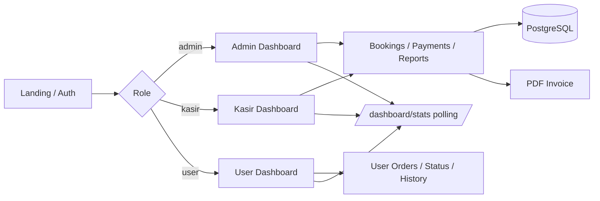

<div align="center">

  

# VAULTLAUNDRY

**Modern laundry operations platform** - booking, monitoring, payments, invoices, reports, and role-based dashboards in one Laravel application.

[](https://laravel.com)
[](https://www.postgresql.org)
[](https://tailwindcss.com)
[](https://alpinejs.dev)

[](https://github.com/andi-nugroho/laundry-laravel/actions/workflows/ci.yml)
[](https://github.com/andi-nugroho/laundry-laravel/actions/workflows/security.yml)

</div>

---

VAULTLAUNDRY helps laundry businesses manage customers, services, bookings, wash status, payments, PDF invoices, and reports with a warm premium UI. The dashboard refreshes through lightweight polling, so the project can run on local development, VPS, and shared hosting without a WebSocket daemon.


## Features

| Area | Capability |
| ---- | ---------- |
| Booking | Create laundry bookings with auto code `LDY-YYYY-0001`, weight-based pricing, and ETA |
| Monitoring | Track status from `booking_masuk` through `diambil` / `dibatalkan` |
| Payments | Cash, transfer, e-wallet, partial and full settlement |
| QRIS / COD | QRIS mock payment flow and cash-on-delivery style options for user orders |
| Dashboard | Role-based statistics with polling refresh and manual `Refresh Data` button |
| Invoice | Compact PDF receipt-style invoices |
| Reports | Transaction and revenue reports for admin/kasir |
| Roles | Admin, kasir, and user with scoped menus and policies |
| WhatsApp | Order success flow with WhatsApp confirmation link for customers |

## Tech Stack

| Layer | Technology |
| ----- | ---------- |
| Backend | Laravel 12 + Laravel Breeze |
| Database | PostgreSQL |
| Frontend | Blade + Tailwind CSS + Alpine.js |
| Landing animation | Lenis smooth scroll for public landing page only |
| Build | Vite |
| PDF | barryvdh/laravel-dompdf |
| Dashboard refresh | Lightweight polling to `/dashboard/stats` every 30 seconds |
| Dev environment | Laravel Sail / Docker Compose optional |

## Database Documentation

Database design, ERD, relations, and business flow are documented in [database/erd.md](database/erd.md). A Word-ready ERD document is available at [database/Rancangan_ERD_VAULTLAUNDRY.docx](database/Rancangan_ERD_VAULTLAUNDRY.docx).

## Continuous Integration

GitHub Actions runs the application test suite with PHP 8.3, Node.js 22, and PostgreSQL 16. CI does not use SQLite, so migrations and queries are tested against the same database engine family used by the project.

Workflows:

- `CI`: install dependencies, migrate PostgreSQL, build frontend, and run Laravel tests.
- `Security`: run `composer audit` and `npm audit --audit-level=high`.
- `Code Quality`: validate Composer, PHP syntax, routes, Blade view cache, and Laravel config cache.

`database/schema.sql` remains a MySQL/MariaDB documentation and manual import reference. It is not the runtime database for CI.

## Installation

### Prerequisites

- PHP 8.2+
- Composer
- Node.js 20+ and npm
- PostgreSQL, or Laravel Sail

### Local Setup

```bash
composer install
npm install
cp .env.example .env
php artisan key:generate
php artisan migrate --seed
npm run build
php artisan serve
```

Open `http://127.0.0.1:8000`.

### With Laravel Sail

```bash
./vendor/bin/sail up -d
./vendor/bin/sail composer install
./vendor/bin/sail npm install
./vendor/bin/sail artisan key:generate
./vendor/bin/sail artisan migrate --seed
./vendor/bin/sail npm run build
```

Open `http://localhost`.

### Development With Hot Reload

```bash
npm run dev
php artisan serve
```

The dashboard still works without `npm run dev`; hot reload is only for frontend development.

### Seeder Accounts

| Role | Email | Password |
| ---- | ----- | -------- |
| Admin | `admin@laundry.test` | `password` |
| Kasir | `kasir@laundry.test` | `password` |
| User | `user@laundry.test` | `password` |

## Architecture & Project Structure

```text
app/
|-- Http/
|   |-- Controllers/      # Booking, Payment, Dashboard, Reports, UserOrder, etc.
|   |-- Middleware/       # RoleMiddleware
|   `-- Requests/         # Form validation
|-- Models/               # User, Customer, Service, Booking, Payment
`-- Policies/             # Authorization per resource

resources/
|-- views/
|   |-- welcome.blade.php # Public landing page
|   |-- dashboard/        # Admin, kasir, user dashboards
|   |-- bookings/, payments/, reports/, etc.
|   `-- components/       # Reusable Blade UI
|-- css/
|   |-- app.css           # Authenticated app styles
|   `-- public.css        # Landing/public page animation styles
`-- js/
    |-- app.js            # Authenticated app entry
    |-- dashboard-polling.js
    |-- guest.js
    `-- public.js         # Landing page Lenis entry

routes/web.php            # Web routes + role groups
database/migrations/      # PostgreSQL schema
public/assets/            # Landing and UI imagery
```

### Request Flow



No `php artisan reverb:start`, WebSocket daemon, or queue worker is required for the core application.

## Main Routes

| Path | Description |
| ---- | ----------- |
| `/` | Landing page |
| `/dashboard` | Role-based redirect |
| `/admin/dashboard` | Admin stats |
| `/kasir/dashboard` | Kasir stats |
| `/user/dashboard` | User stats |
| `/bookings` | Booking management |
| `/monitoring` | Status monitoring |
| `/payments` | Payments and invoice |
| `/reports/transactions` | Transaction report |
| `/reports/revenue` | Revenue report |
| `/user/pesan-laundry` | User order flow |
| `/user/status-cucian` | User wash status |
| `/user/riwayat` | User booking history |

## Useful Commands

```bash
composer dump-autoload
php artisan test
php artisan route:list
npm run build
```

## Contributing

Contributions are welcome. Please read:

- [CONTRIBUTING.md](CONTRIBUTING.md)
- [CODE_OF_CONDUCT.md](CODE_OF_CONDUCT.md)
- [SECURITY.md](SECURITY.md)

## License

MIT © 2026 [Andi Nugroho](https://andidelouise.net). See [LICENSE](LICENSE).

## Author

Created by **[Andi Nugroho](https://andidelouise.net)** · [GitHub](https://github.com/andi-nugroho)