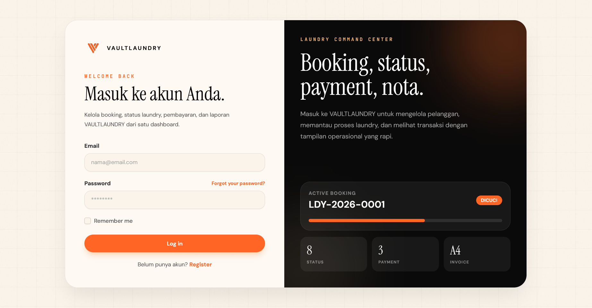
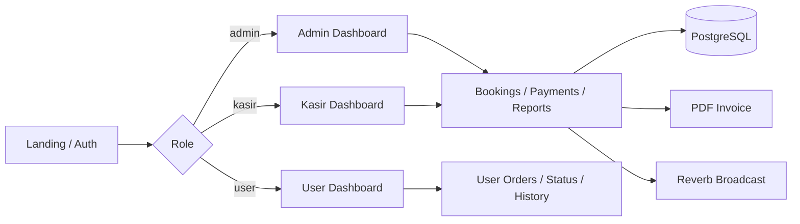
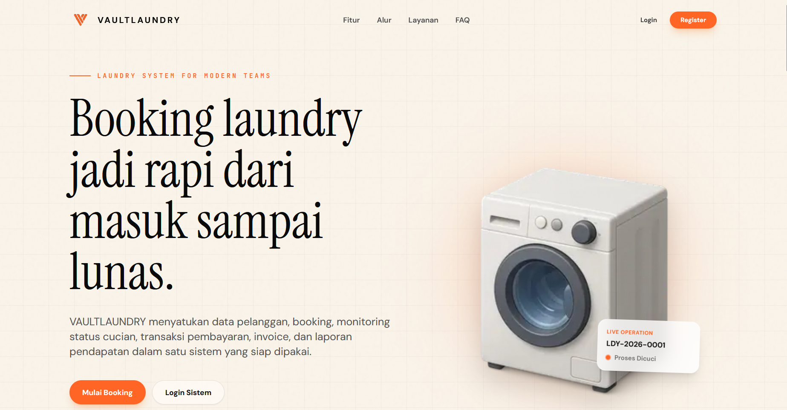
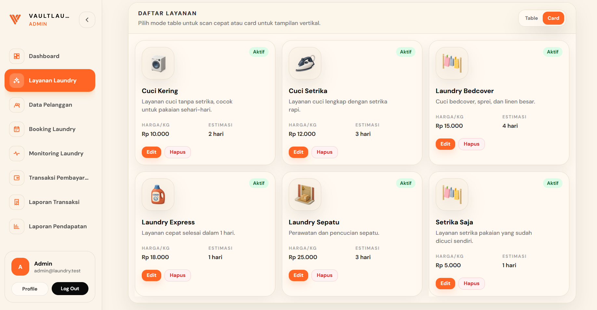

<div align="center">

  

# VAULTLAUNDRY

**Modern laundry operations platform** — booking, monitoring, payments, invoices, and realtime dashboards in one Laravel application.

[](https://laravel.com)
[](https://www.postgresql.org)
[](https://tailwindcss.com)
[](https://alpinejs.dev)

[](https://github.com/andi-nugroho/laundry-laravel/actions/workflows/ci.yml)
[](https://github.com/andi-nugroho/laundry-laravel/actions/workflows/security.yml)

</div>

---

VAULTLAUNDRY helps laundry businesses manage customers, bookings, wash status, payments (Cash / Transfer / QRIS), PDF invoices, and role-based dashboards for **admin**, **kasir**, and **user** — with a warm premium UI and optional realtime updates via Laravel Reverb.



## Features

| Area | Capability |
| ---- | ---------- |
| **Booking** | Create laundry bookings with auto code `LDY-YYYY-0001`, weight-based pricing, and ETA |
| **Monitoring** | Track status from `booking_masuk` through `diambil` / `dibatalkan` |
| **Payments** | Cash, transfer, e-wallet, partial and full settlement |
| **QRIS / COD** | QRIS payment flow and cash-on-delivery style options for user orders |
| **Realtime dashboard** | Live stats via Laravel Reverb + Echo when broadcast is enabled |
| **Invoice** | Compact PDF receipt-style invoices |
| **Roles** | Admin, kasir, and user with scoped menus and policies |
| **WhatsApp** | Order success flow with WhatsApp confirmation link for customers |

## Tech Stack

| Layer | Technology |
| ----- | ---------- |
| Backend | [Laravel 12](https://laravel.com) + [Laravel Breeze](https://laravel.com/docs/starter-kits#laravel-breeze) |
| Database | [PostgreSQL](https://www.postgresql.org) |
| Frontend | [Tailwind CSS](https://tailwindcss.com) + [Alpine.js](https://alpinejs.dev) + Blade |
| Build | [Vite](https://vitejs.dev) |
| PDF | barryvdh/laravel-dompdf |
| Realtime | [Laravel Reverb](https://laravel.com/docs/reverb) + Laravel Echo |
| Dev environment | Laravel Sail / Docker Compose (optional) |

## Database Documentation

Rancangan database, Entity Relationship Diagram (ERD), relasi antar tabel, dan alur bisnis secara lengkap dapat dilihat di dokumen **[database/erd.md](database/erd.md)**.

## Continuous Integration

GitHub Actions menjalankan application test suite dengan **PHP 8.3**, **Node.js 22**, dan service **PostgreSQL 16**. CI tidak menggunakan SQLite sehingga migration dan query diuji pada database engine yang sama dengan environment utama project.

Workflow yang tersedia:

- `CI`: install dependency, migrate PostgreSQL, build frontend, dan menjalankan Laravel tests.
- `Security`: menjalankan `composer audit` dan `npm audit --audit-level=high`.
- `Code Quality`: validasi Composer, PHP syntax, route, Blade view cache, dan Laravel config cache.

File `database/schema.sql` berformat MySQL/MariaDB tetap dipertahankan hanya sebagai dokumentasi dan alternatif manual import. File tersebut bukan database utama dan tidak digunakan oleh CI.

## Repository

**https://github.com/andi-nugroho/laundry-laravel**

Clone:

```bash
git clone https://github.com/andi-nugroho/laundry-laravel.git
cd laundry-laravel
```

## Installation

### Prerequisites

- PHP 8.2+, Composer
- Node.js 20+, npm
- PostgreSQL (or use Sail)

### Steps

```bash
composer install
npm install
cp .env.example .env
php artisan key:generate
php artisan migrate --seed
npm run build
```

### With Laravel Sail

```bash
./vendor/bin/sail up -d
./vendor/bin/sail composer install
./vendor/bin/sail npm install
./vendor/bin/sail artisan key:generate
./vendor/bin/sail artisan migrate --seed
./vendor/bin/sail npm run dev
```

Open **http://localhost** (Sail) or **http://127.0.0.1:8000** (`php artisan serve`).

### Development (hot reload)

```bash
npm run dev
php artisan serve
```

### Realtime (optional)

Set Reverb variables in `.env` (see `.env.example`), then:

```bash
php artisan reverb:start
```

With Sail:

```bash
./vendor/bin/sail artisan reverb:start --host=0.0.0.0 --port=8080
```

If Reverb is not running, dashboards still work; stats load on page refresh.

### Seeder accounts

| Role | Email | Password |
| ---- | ----- | -------- |
| Admin | `admin@laundry.test` | `password` |
| Kasir | `kasir@laundry.test` | `password` |
| User | `user@laundry.test` | `password` |

## Architecture & Project Structure

```text
app/
├── Events/              # BookingChanged, PaymentChanged (broadcasting)
├── Http/
│   ├── Controllers/     # Booking, Payment, Dashboard, Reports, UserOrder, …
│   ├── Middleware/      # RoleMiddleware
│   └── Requests/        # Form validation
├── Models/              # User, Customer, Service, Booking, Payment
└── Policies/            # Authorization per resource

resources/
├── views/
│   ├── welcome.blade.php    # Public landing page
│   ├── dashboard/           # Admin, kasir, user dashboards
│   ├── bookings/, payments/, reports/, …
│   └── components/          # Reusable Blade UI
├── css/app.css              # VAULTLAUNDRY design tokens & utilities
└── js/                      # Vite entry, Echo/Reverb client

routes/web.php             # Web routes + role groups
database/migrations/       # PostgreSQL schema
public/assets/             # Landing & UI imagery (webp)
config/reverb.php          # Realtime server config
```

### Request flow (simplified)



## Deployment Notes

1. Set `APP_ENV=production`, `APP_DEBUG=false`, and a strong `APP_KEY`.
2. Configure PostgreSQL (`DB_*`) and run `php artisan migrate --force`.
3. Build assets: `npm ci && npm run build`.
4. Cache config for performance:

   ```bash
   php artisan config:cache
   php artisan route:cache
   php artisan view:cache
   ```

5. Run queue worker if using queued jobs: `php artisan queue:work`.
6. For realtime, deploy **Laravel Reverb** (or compatible websocket server) and set `REVERB_*` / `VITE_REVERB_*` in production.
7. Point the web server document root to `public/`.
8. Ensure `storage/` and `bootstrap/cache/` are writable.

Docker/Sail is recommended for local parity; production can use any PHP 8.2+ host (Forge, VPS, etc.).

## Screenshots

| Landing Page | Dashboard |
| ------- | --------- |
|  |  |

Additional UI captures can be placed under `public/assets/` and linked here.

## Main Routes

| Path | Description |
| ---- | ----------- |
| `/` | Landing page |
| `/dashboard` | Role-based redirect |
| `/admin/dashboard` | Admin stats |
| `/kasir/dashboard` | Kasir stats |
| `/user/dashboard` | User stats |
| `/bookings` | Booking management |
| `/monitoring` | Status monitoring |
| `/payments` | Payments & invoice |
| `/reports/transactions` | Transaction report |
| `/reports/revenue` | Revenue report |
| `/user/status-cucian` | User wash status |
| `/user/riwayat` | User booking history |

## Useful Commands

```bash
php artisan test
php artisan route:list
./vendor/bin/pint
npm run build
```

## Contributing

Contributions are welcome. Please read:

- [CONTRIBUTING.md](CONTRIBUTING.md)
- [CODE_OF_CONDUCT.md](CODE_OF_CONDUCT.md)
- [SECURITY.md](SECURITY.md)

## License

MIT © 2026 [Andi Nugroho](https://andidelouise.net). See [LICENSE](LICENSE).

## Author

Created by **[Andi Nugroho](https://andidelouise.net)** · [GitHub](https://github.com/andi-nugroho)
