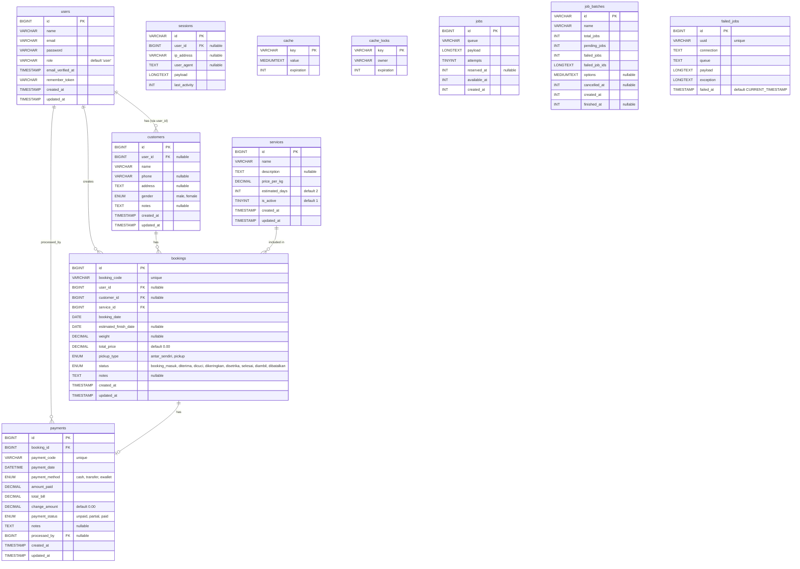

# VAULTLAUNDRY - Entity Relationship Diagram (ERD)

Dokumen ini berisi rancangan dan Entity Relationship Diagram (ERD) untuk database VAULTLAUNDRY.

## Mermaid ERD



## Relasi Antar Tabel

- **users 1..n bookings**: Seorang user dapat membuat banyak booking.
- **users 1..n payments (sebagai processed_by)**: Seorang user (kasir/admin) dapat memproses banyak pembayaran.
- **users 1..1/1..n customers (via user_id)**: Seorang user dapat terkait dengan satu atau lebih data customer (sebagai akun customer).
- **customers 1..n bookings**: Seorang customer dapat memiliki banyak booking.
- **services 1..n bookings**: Sebuah layanan (service) dapat dipilih dalam banyak booking.
- **bookings 1..1 payments**: Setiap booking memiliki tepat satu record pembayaran.

## Penjelasan Tabel

### 1. `users`
- **Fungsi**: Menyimpan data pengguna aplikasi, baik itu admin, kasir, maupun pelanggan (user).
- **Primary Key**: `id`
- **Foreign Key**: Tidak ada
- **Field Penting**: `email` (unique), `password`, `role` (menentukan hak akses: admin, kasir, user).
- **Enum/Status**: `role` default 'user'.

### 2. `customers`
- **Fungsi**: Menyimpan data profil pelanggan. Dipisahkan dari `users` agar pelanggan yang tidak memiliki akun tetap dapat didata.
- **Primary Key**: `id`
- **Foreign Key**: `user_id` (merujuk ke `users.id`, nullable).
- **Field Penting**: `name`, `phone`, `address`.
- **Enum/Status**: `gender` ('male', 'female').

### 3. `services`
- **Fungsi**: Menyimpan daftar layanan laundry yang tersedia beserta harga dan estimasi waktu selesai.
- **Primary Key**: `id`
- **Foreign Key**: Tidak ada
- **Field Penting**: `name`, `price_per_kg`, `estimated_days`.
- **Enum/Status**: `is_active` (boolean, default 1).

### 4. `bookings`
- **Fungsi**: Menyimpan transaksi pesanan laundry (booking).
- **Primary Key**: `id`
- **Foreign Key**: `user_id` (users), `customer_id` (customers), `service_id` (services).
- **Field Penting**: `booking_code`, `total_price`, `weight`.
- **Enum/Status**: 
  - `pickup_type`: 'antar_sendiri', 'pickup'
  - `status`: 'booking_masuk', 'diterima', 'dicuci', 'dikeringkan', 'disetrika', 'selesai', 'diambil', 'dibatalkan'.

### 5. `payments`
- **Fungsi**: Menyimpan data pembayaran terkait suatu booking.
- **Primary Key**: `id`
- **Foreign Key**: `booking_id` (bookings), `processed_by` (users).
- **Field Penting**: `payment_code`, `amount_paid`, `total_bill`, `change_amount`.
- **Enum/Status**:
  - `payment_method`: 'cash', 'transfer', 'ewallet'
  - `payment_status`: 'unpaid', 'partial', 'paid'.

## Business Flow Database

1. **User/Customer membuat booking**: Data disimpan di tabel `bookings`. Jika user melakukan booking, `user_id` diisi. Jika kasir mendaftarkan tanpa akun, hanya `customer_id` yang digunakan.
2. **Booking memilih service**: Setiap `bookings` memiliki `service_id` yang menentukan tarif dan estimasi waktu.
3. **Payment dibuat dari booking**: Saat booking dibuat, sebuah record di tabel `payments` otomatis dibuat (status default 'unpaid').
4. **Kasir/admin memproses status**: Status booking diperbarui seiring berjalannya proses laundry. `processed_by` pada tabel pembayaran mencatat siapa yang menerima uang.
5. **Invoice PDF dibuat dari payment**: Invoice tidak memiliki tabel fisik, melainkan di-generate langsung dari data `payments`, `bookings`, dan relasinya ketika dibutuhkan.

## Catatan Penting

- File `schema.sql` disediakan sebagai dokumentasi dan manual import (MySQL/MariaDB).
- **Source of truth (sumber kebenaran) utama struktur database tetap pada Laravel Migration** yang ada di folder `database/migrations`.
- PostgreSQL disarankan sebagai database utama untuk development.

## Normalisasi Singkat

- **users dipisah dari customers**: Hal ini memungkinkan sistem mencatat pelanggan walk-in yang tidak ingin membuat akun.
- **services dipisah dari bookings**: Memudahkan perubahan harga layanan di masa depan tanpa mengubah data historis.
- **payments dipisah dari bookings**: Memungkinkan skenario pembayaran cicilan/DP dan memudahkan pelaporan keuangan.
- **invoice tidak disimpan secara fisik**: Karena invoice merupakan gabungan data yang dapat direkonstruksi dari `bookings` dan `payments`, menyimpannya akan menyebabkan redundansi.

## Cardinality Summary

| Relasi | Tipe | Keterangan |
| :--- | :--- | :--- |
| Users - Bookings | 1 : N | User membuat banyak booking |
| Users - Payments | 1 : N | Kasir memproses banyak payment |
| Users - Customers | 1 : 1/N | User memiliki profil customer |
| Customers - Bookings | 1 : N | Customer memiliki banyak booking |
| Services - Bookings | 1 : N | Service digunakan banyak booking |
| Bookings - Payments | 1 : 1 | Tiap booking punya satu payment |

## ERD Text Summary

```text
Users
 ├── Customers
 ├── Bookings
 │    ├── Services
 │    └── Payments
 └── Payments (processed_by)
```
